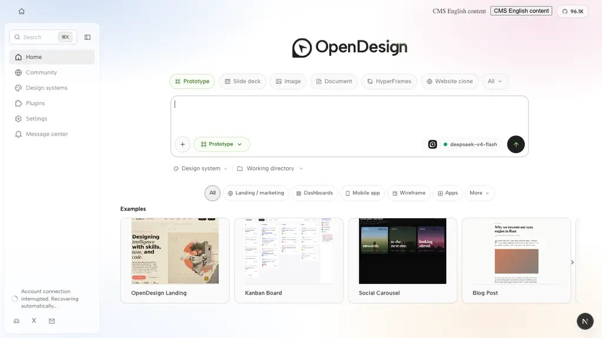
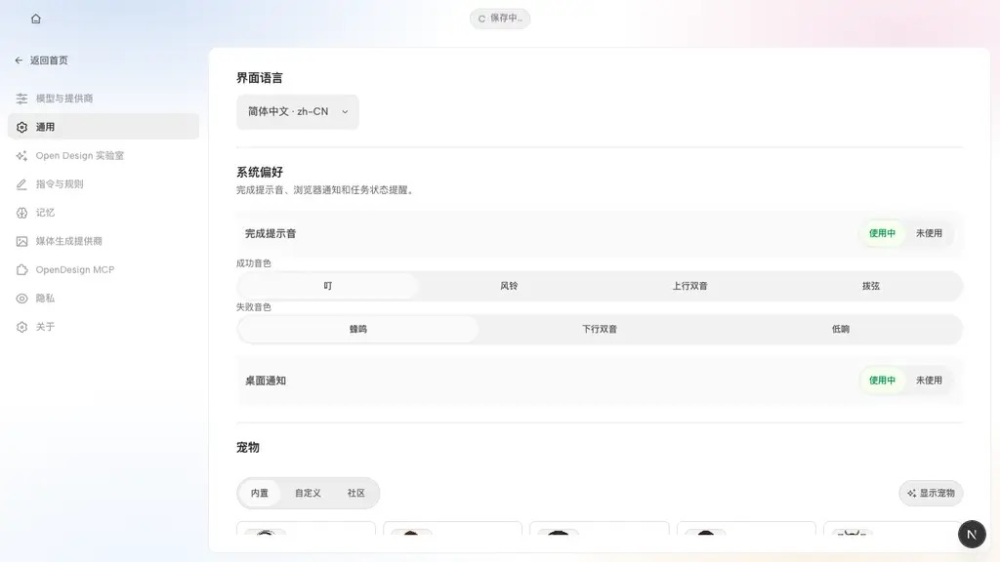
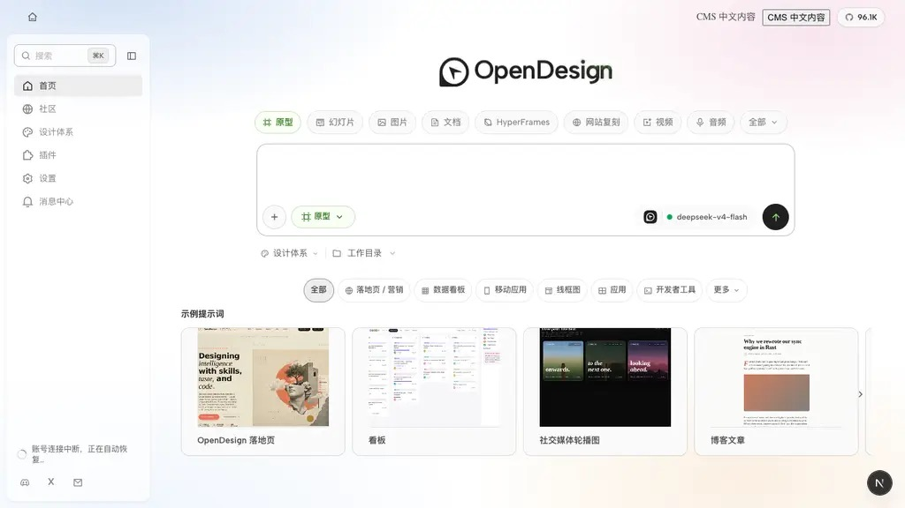

# CMS Codex 验收交接（2026-09-10）

## 目的与边界

本交接覆盖本 PR 的已完成代码、可复跑验收和剩余阻断项；它**不**授权合并、部署、生产操作、Plane 更新或自动关闭任何工单。认证、部署状态、远端 CI、合并和已部署版本均为 **UNKNOWN**，除非接手者以自己的安全登录态重新读取并记录。不得读取凭据、不得静默改指向生产、不得接管其他运行时。

依赖顺序：既有 Vela #1963 的分支 `codex/cms-content-selection` → 本 Vela 后续 PR；既有 Open Design #7986 的分支 `codex/fix-cms-shared-manifest`（其原有 base `codex/cms-admin-hosts-e2e` 保持不变）→ 本 OD 后续 PR。两仓库不可合为一个 PR。

## 状态矩阵

| 验收 ID | 状态 | 本 PR 实现/本地测试 | 当前浏览器/集成 | 结论 |
|---|---|---|---|---|
| AC-2998 | 已实现，局部验证 | 四位年份上限、blur/save；Admin 定向测试与 lint 通过 | Admin 真浏览器和持久化读回 UNKNOWN | 不可声称已部署 |
| AC-3020 | 已实现，局部验证 | API/BFF/Admin 字段错误、create/edit 保留及 update failure-seam 测试通过 | 真 Admin/API UNKNOWN | 不可声称已部署 |
| AC-3000 | 已实现，局部验证 | 反斜杠/控制字符/哨兵源拒绝，query/hash 允许；contracts 通过 | 受控 Chromium helper 通过；所有 placement/Test 默认拒绝 UNKNOWN | 非端到端 |
| AC-3001 | 已实现，局部验证 | host fingerprint 纳入 overlay；定向测试通过 | 编译运行时 fingerprint UNKNOWN | 开发者指纹测试，不是通用 UI 断言 |
| AC-3009 | 部分实现 | 内容尺寸/视口 CSS 与测试通过；保留无条件 host Close 兼容 fallback | 精确编译包、500px/窄/短滚动 UNKNOWN | 重复 Close **未修复** |
| AC-3010 | 既有 base 行为 | 无本 PR 独立修复 | UNKNOWN | 不归功于本 PR |
| AC-3013 | 已实现，局部验证 | top-right host/相对定位及结构测试通过 | 最终 EntryShell/账号角标集成 UNKNOWN | 不可声称完整布局验收 |
| AC-3014 | 部分浏览器验证 | hover 几何与组件测试通过 | 受控 Chromium：三次慢速正反跨 8px、可信 Shadow SDK action、Escape 焦点、窄屏翻转通过；非真实 dispatcher/native linked runtime | 受控证据，不是全链路 |
| AC-3002 | **FOLLOW-UP / FAIL** | 当前 `ProductionCampaignModal` 仍 await telemetry；500/network 拒绝已授权 action | 不把早期 Vela click harness 当 OD 重现 | 必须单独修复后复测 |

历史恢复/既有事项 2999、3005、3007、2982、3021 不是本 PR 的自有变更；恶意 SVG 与五个 pending receipt 仍为历史未闭环发现。源 ZIP 中缺少 `girl.webp` 并不代表包损坏：源 `girl-source.jpg` 会编译为 `girl.webp`。

## 可观察验收（测试人员）

- **AC-2998**：新建与编辑各输入六位年份，blur 后保存应拒绝；输入有效四位年份，日历值保存后保持。
- **AC-3020**：分别验证 past-start、end<=start、missing、not-ready、unsupported placements 的单字段错误；新建/编辑中返回 4xx 与拒绝的 5xx 都保留名称、Ready 内容版本、placements、开始、结束、时区六字段。Ready selector 可能阻止无效版本，需使用受控后端错误 fixture，不要伪造 UI 输入。
- **AC-3000**：`/projects?view=active#recent` 可用；反斜杠、`/\\evil.example`、slash+tab/newline 必拒绝；混合 manifest 只允许本 host action；Test 默认拒绝。
- **AC-3013/3014**：右上入口与账号角标同时存在且没有底部重复；慢速正向/反向各跨 8px 缝隙三次后可点真实 action；再验外部离开、窄屏翻转、Escape 与焦点返回。
- **AC-3009**：500px、窄屏、短屏滚动与 fallback Close；记录“重复 Close 未修复”，不得把 fallback 当单一 Close 证明。
- **AC-3002（修复后强制复测）**：先保持 auth 拒绝，再独立验证 telemetry 500/network 不撤销已经授权的 action；冻结策略后再分类 401/403/409。
- **AC-3001**：比较开发者提供的编译包 fingerprint，不以普通 UI 画面替代。

## 安全运行手册

1. 以两个隔离 checkout 加载候选；先确认显示的 source/build runtime 属于候选 SHA，绝不复用或重启用户拥有的 `17686/17687`、`agent-cms-operator-da21`。
2. Open Design 仅按 scoped docs 启动：`OD_DATA_DIR=<candidate>/.tmp/joint-validation-browser/data corepack pnpm@10.33.2 tools-dev run web --namespace cms-joint-validation-browser --daemon-port 19786 --web-port 19787`。端口 `19786/19787` 及 fixture `19788` 为本次 owned 约定；如占用，停止并记录，不接管。
3. Vela 仅用其 scoped docs 的 `pnpm dev` / `with-env` 隔离命令和自己的 sandbox；不自行编造认证、fixture 或环境变量。需要登录时请测试者通过安全用户登录完成，不读 secret。
4. 固定源归档：`/Users/alche/Downloads/deepseek-v4.1-flash-五点位测试组件.zip`，SHA-256 `690d897450e4a53af269ffcd40cb4ab393652f58b5856cfd8abf9f6185028ad6`。每次还要记录**新编译包**的身份/fingerprint；历史活动 `wobpnxd7ptplgjjzevqx9xyd` 与 deployment `gbaa211ukd9duci6c66prrgy` 不是当前已验证身份。
5. 每条证据使用：`ID / 步骤 / 期望 / 实际 / PASS|FAIL|UNKNOWN / build SHA / 环境 / 包 SHA / 时间 / 截图或网络或 receipt / 回归影响`。Codex 返回报告与 defect；不得宣称获得 merge/deploy 授权。

## 最终无回归门（所有修复、所有最终 commit 之后）

对每个 bug 用相同 client/environment/package 重复原始复现；只隔离比较 baseline，绝不回退用户运行时。随后跑：五个 placement、upload→build→Ready→Test→retract→edit→new Test、stale-context deny、receipt 在 Admin 持久可见、modal/badge/hover 共存、locale、calendar、schedule/expiry/revocation、可恢复网络失败。生产共存只允许隔离 test fixture，不做生产操作。任一复测失败：修复→复测→重跑受影响回归；最终 SHA 改变即使旧证明失效。完整验收要求无 P0/P1；部分 PR 是否合并必须显式人工决定，绝不自动。

回滚仅通过已评审的 follow-up revert PR；禁止盲 revert 或生产回滚。签收：**PENDING**。

## 开发者附录

### 客户端语言联动补充（2026-09-14）

- 生产弹窗、账号徽标、悬浮入口与详情使用客户端 i18n 语言，并以「账号 + 语言」隔离加载、授权和挂载状态；渲染仍使用 CMS 返回的 `content.locale`，不改服务端翻译与回退规则。
- 验收入口：设置 → 通用 → 界面语言。切换后返回首页，徽标与悬浮入口/详情应显示新语言；相同 activity、decision 和 content version 身份不能阻止语言替换。
- 正在显示的同一活动弹窗取得新语言授权后继续展示；已关闭的活动不能因切换语言重新弹出。旧语言迟到响应和失效授权不得恢复旧展示。
- 回归入口：`apps/web/tests/components/ProductionCampaignBadge.test.tsx`、`ProductionCampaignHover.test.tsx`、`ProductionCampaignModal.test.tsx`，以及 `touchpoint-lifecycle.test.ts`。
- 本地浏览器通过实际设置控件执行英文 → 简体中文 → 英文，并观察请求参数与 Shadow DOM 内容；中文弹窗关闭后切回英文未重开。验证边界：真实 web/daemon + 本地 CMS HTTP fixture + 模拟官方桌面宿主接口，非真实 Electron 或线上 CMS 验收。fixture 未提供账号工作区服务，截图中的账号连接提示不是本次验收对象。

| 英文首页 | 语言设置入口 | 中文首页 |
|---|---|---|
|  |  |  |

- Vela 协议源 `packages/shared/src/touchpoints.ts` 的最终 SHA-256：`be26f9c4e5cfe6e0a0eedee3d31dc70df8f1c8ee61704e765d4f5c89879fc2f0`；OD `TOUCHPOINT_COMPONENT_V2_UPSTREAM_PROVENANCE.sourceSha256.touchpoints` 必须与其一致。
- 已记录本地：Vela root `pnpm lint` PASS；Edit 定向 `42 passed`；OD contracts `6`、combined `30`、typecheck/guard PASS。此前 OD #3001 production build 只可称“单独验证”，不可称 combined build。
- #3002 源缺陷位置：`apps/web/src/components/ProductionCampaignModal.tsx:96-128`。#3009 仅为 sizing patch，unconditional host Close 保留。
